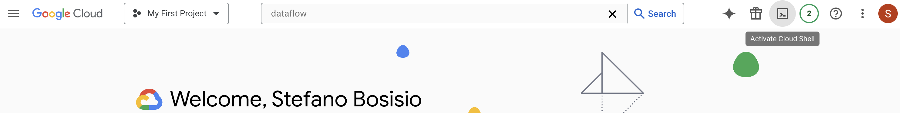

### Running example on Dataflow

This code can be run directly on Dataflow.

### Setup the Dataflow environment in GCP shell

Follow the slides to setup the GCP environment. Then, activate the GCP Shell in your GCP project:



From the bash shell, clone this repository:

```bash
git clone https://github.com/Steboss/your_first_mlops_stack.git
```
Then `cd` in the repository folder and install the requirements:

```bash
cd your_first_mlops_stack/04_wordcount_on_dataflow
pip3 install -r requirements.txt
```

Finally, you can run the pipeline directly on Dataflow:
```bash

PROJECT_ID=$(gcloud config get-value project)


python pipeline.py --runner DataflowRunner \
        --input gs://dataflow-samples/shakespeare/kinglear.txt \
        --output-file gs://output-results-for-dataflow-tests/output-word-count-${DATE}.txt \
        --job_name wordcount-pipeline \
        --project ${PROJECT_ID} \
        --region europe-west1 \
        --temp_location gs://your-temp-bucket-for-dataflow-tests
```