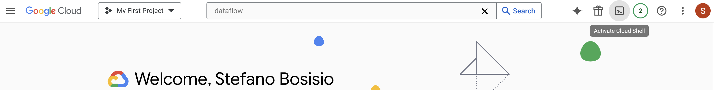

### Example on Dataflow flex template deployment

This is an example on using Beam Windowing, deploying the pipeline with the flex template.

#### 1. Setup the Dataflow environment in GCP shell

Follow the slides to setup the GCP environment. Then, activate the GCP Shell in your GCP project:




#### 2. Clone the repo

From the bash shell, clone this repository:

```bash
git clone https://github.com/Steboss/your_first_mlops_stack.git
```
Then `cd` in the repository folder and install the requirements:
```bash
cd your_first_mlops_stack/05_flex_template
```

#### 3. Build the docker image and flex template

The first step for creating a Dataflow flex template is to build the image of the pipeline. Then, this image can be used to create a flex template for dataflow.
The script `scripts/build_flex_template.sh` does this for you. Run it as:
```bash
bash scripts/build_flex_template.sh
```

This is what happens:

- The docker image `window_pipeline` is created from the input `Dockerfile`
- The image is tagged, so it can be pushed to the artifact registry: `europe-west2-docker.pkg.dev/${PROJECT_ID}/normal-window-pipeline/window_pipeline:latest`; where `normal-window-pipeline` is the name of the artifact registry repository.

Then, the `gcloud dataflow flex-template build` command is used:
- This command needs a google storage, `gs`, path to store the `json` template file
- an input image for the pipeline
- the language we want to use, in this case `"PYTHON"`
- the input metadata for our pipeline, that are stored in `metadata/metadata.json`
- the region where we want the pipeline's workers to run from
- some env variables, that define the paths to the code, the requirement files and the `setup.py` file
- a `py-path` indication, namely where all the files can be found. In this case it's in the current directory.

#### 4. Deploy the flex template

It's now time to deploy the flex template and see it working! The script `scripts/run_flex_template.sh` does this for you. Run it as:
```bash
bash scripts/run_flex_template.sh
```

The script invokes `gcloud dataflow flex-template run`, and it sets up the input conditions and parameters we want to use. In this case, the pipeline will run on a `n1-standard-2` machine with 1 worker.