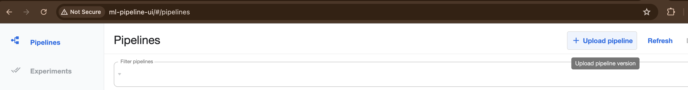
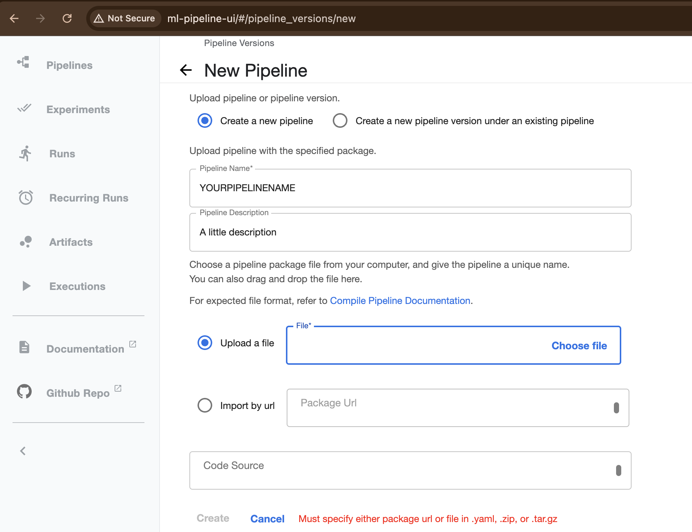
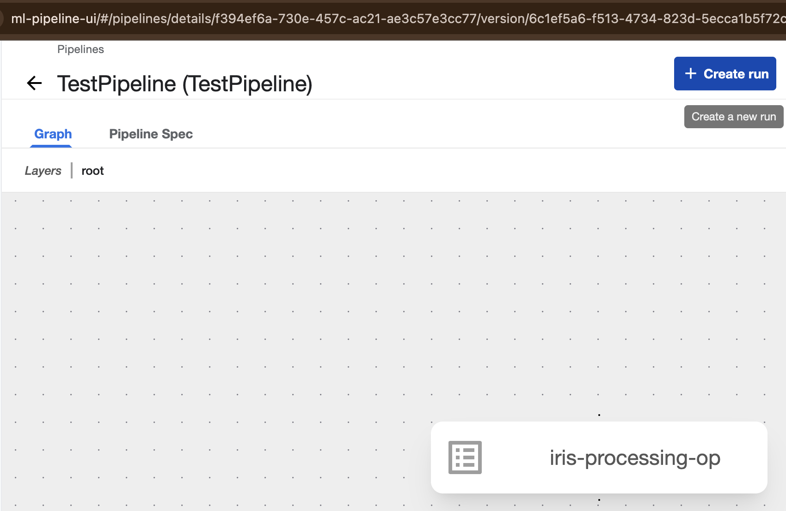
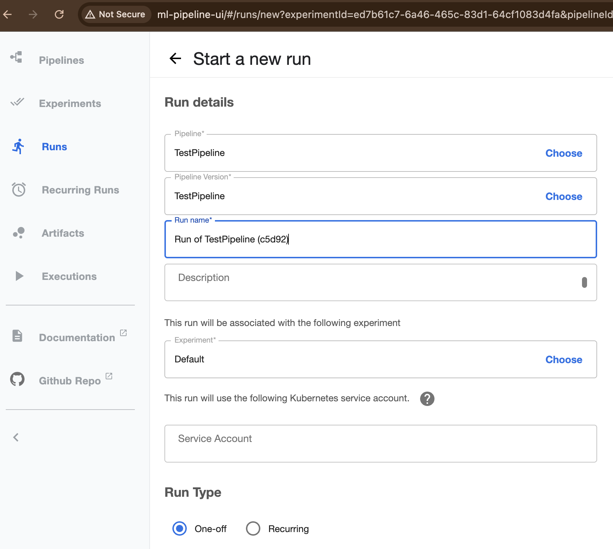

### Iris model pipeline

This pipeline runs a simple model against the iris dataset.
You'll need two use two bash shells at the same time for this tutorial. Both of them can be in the current folder.


#### 1. Installation of KFP locally

KFP works on Kubernetes-like infrastructures. I tried to create a method for running a pipeline, that could be general enough and be used also on latest Mac M* computers. For this you can look into [kubeflow_locally_mac_m](../kubeflow_locally_mac_m/) where all the needed scripts are grouped.

##### 1a. Install requirements

```bash
bash ../kubeflow_locally_mac_m/1_install_reqs.sh
```

The requirements are `k3d`, `k9s`, `kubefwd`:
- `k3d`: is a wrapper ro tun a minimal Kubernetes distribution in docker. This will make sure our environment looks like Kubernetes
- `k9s`: this is a CLI tool for Kuberentes. We won't use it direclty, but it's needed for installing all the necessary requirements on the system.
- `kubefwd`: this is a tool for Kubernetes Port Forwarding, that works for local development.  We'll need this to do a Port Forwarding, for connecting to the Kubeflow UI locally.

Once the requirements have been installed, we can create our own Kubernetes local clusters. This is done on the last line of the script `1_install_reqs.sh`
```
k3d cluster create localkfp -a 1 -s 1 --servers-memory 8Gb
```
The cluster name will be named `localkfp`. `-a` specifies the number of agents for the cluster, 1 is enough for our purpoposes. `-s` is the number of servers, this is useful for multi-servers tests, but, again, 1 is enough. Finally `--servers-memory` specifies the memory of the server, where 8 GB is enough.

At last, you need `kubectl` to be installed on your laptop too. `kubectl` is the control command for working on Kubernetes. You can find [here](https://kubernetes.io/docs/tasks/tools/install-kubectl-macos/) the guide to install it.

###### 1b. Install KFP pipelines

We'll be installing KFP pipeline version `2.0.3`. The installation is done as if we were on Kuberentes, so we'll use `kubectl` to apply changes on our Kubernetes cluster.
To do this you need to simply run the following script:
```bash
bash ../kubeflow_locally_mac_m/2_install_pipelines.sh
```

###### 1c. Connect to the KFP UI

Now you can finally connect to the Kubeflow UI. In the current bash shell run:
```bash
bash ../kubeflow_locally_mac_m/3_connect_local_host.sh
```

This scripts uses `kubefwd` that will port-forward the kubeflow connection. In this way, you'll see the KFP UI by simply going on your favourite browser and go to `http://ml-pipeline-ui:80`


#### 2 On the second shell, let's install the requirements

Now move on the second shell you've opened. The first shell will guarantee we have the connection to the localhost for Kubeflow UI. In this second shell we will run the Kubeflow pipeline.

First install the needed requirements. You can do this, again, through a `conda` environment or through a `venv`.
For Conda:

```bash
bash scripts/create_conda_env.sh

# activate the conda environment
conda activate kfp_pipeline
```

If you do not want to have `conda` on your laptop, you can install everything in a virtual environment:
```bash
python -m venv venv

# activate your virtual environment
venv/bin/activate
# install the requirements
pip install -r requirements.txt
```

#### 3 Create the image of your model code

In this tutorial we have `process_iris.py`. This code contains the real model that we want to run against the Iris dataset.
For KFP to read a custom model, we need to containerized it. Once we have the docker image KFP will be able to pick it up.

BE CAREFUL. The script `scripts/build_docker.sh` assumes you have an account on [Docker Hub](https://hub.docker.com). Create an account if you don't have one, and login to Docker with your account before running the script.

To build the docker image, you can use the script:
```bash
bash scripts/build_docker.sh
```
This will create on your Docker Hub a public image `${DOCKER_USER}/iris-processor:latest`.

#### 4 Upload the compile yaml file and run the pipeline

In this example I want to show you a second technique we could use to deploy (manually) pipeliens on KFP.

```bash
python pipeline/pipeline.py
```

This command will generate the `pipeline.yaml` file, needed for KFP to run.

Then, remember always to have in one terminal the connection open to the KFP UI, go to `http://ml-pipeline-ui:80` and click on "Upload pipeline":



In the new window you'll have to give the name of your pipeline (e.g. `irispipeline`), a little description (it's always good practice to have a description), and upload teh `pipeline.yaml` file:



Once that's done you can click on `Create`

This will create a KFP pipeline.
Following, from there you can create a run from the pipeline. This is very important. A pipeline is a static object. You can run it as many times as you want, with different input parameters. A run is a single run from a pipeline, with some specified parameters. Now, we need to create a run to actionate the pipeline. Click on `Create run`:



Then, in the new prompt, you'll have to specify the inputs for your run, Give a `Run Name`, a `Description` and associate this run with the `Default` Experiment. Finally click on `Start` at the bottom of the page.




